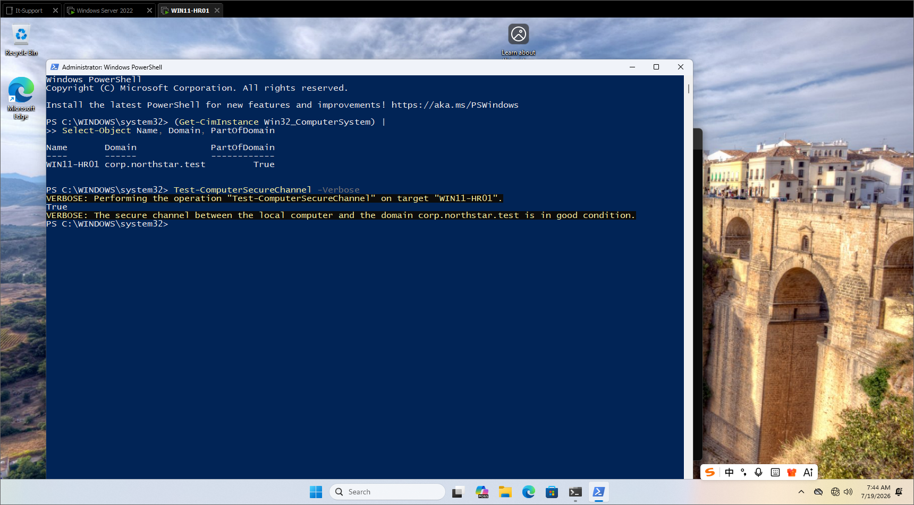
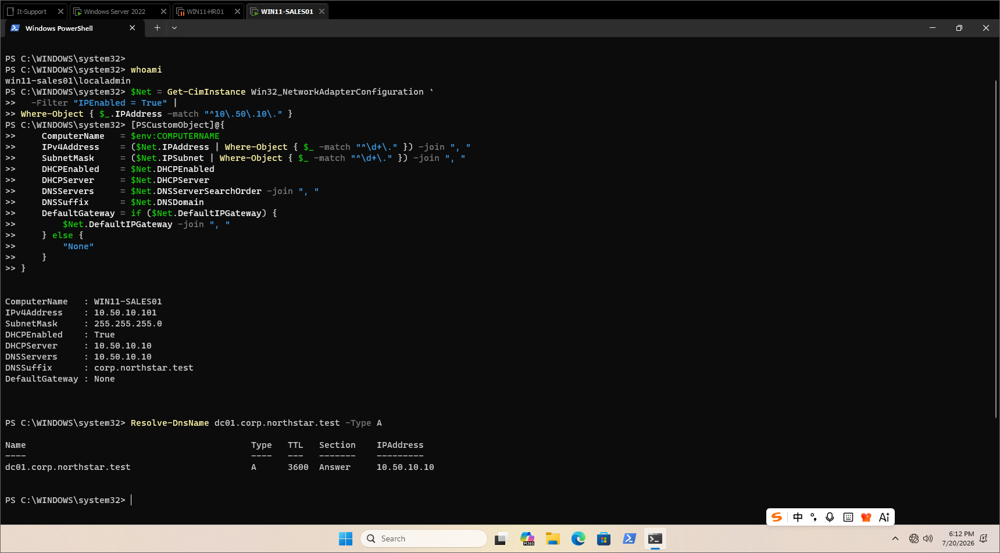
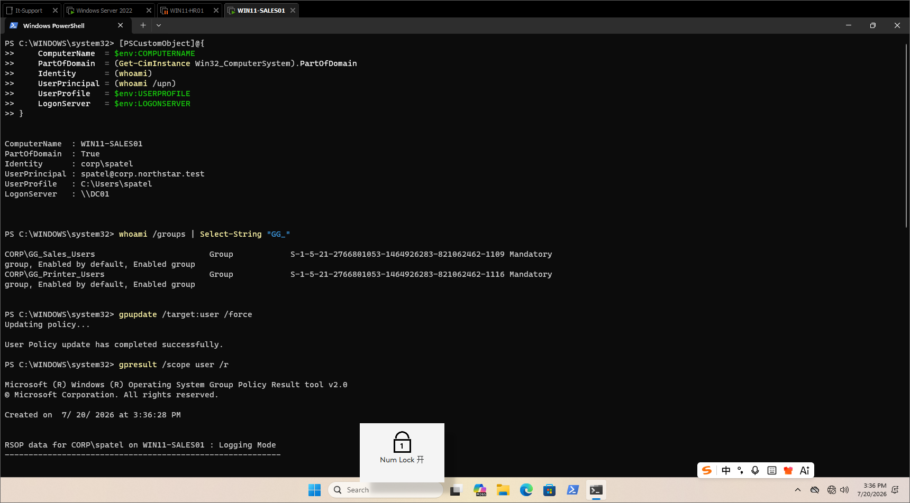
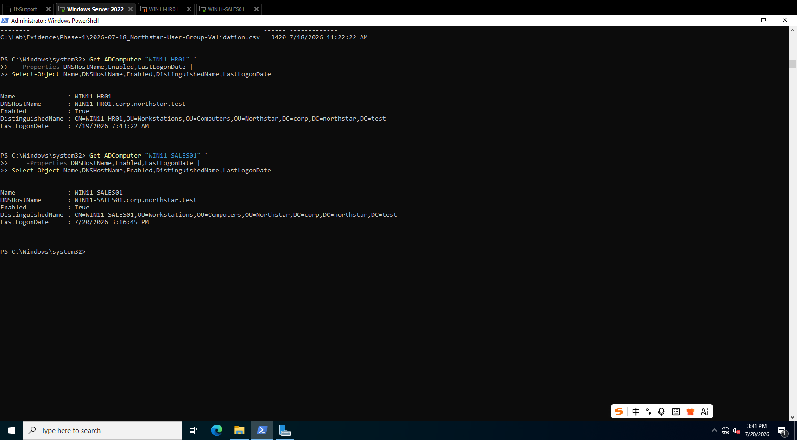

# Windows Client Deployment Milestone

Date recorded: **2026-07-21**  
Technical checkpoint completed: **2026-07-20**  
Phase: **Phase 1 - Identity and Foundational Networking**

## Outcome

Two Windows 11 Pro endpoints have completed the Northstar Phase 1 acceptance path:

- `WIN11-HR01` - HR workstation using DHCP address `10.50.10.100`
- `WIN11-SALES01` - Sales workstation using DHCP address `10.50.10.101`

Both endpoints use DC01 (`10.50.10.10`) for DHCP and internal DNS on the isolated VMnet3 network. No default gateway is assigned during Phase 1 by design.

## Acceptance checks completed

- Verified distinct workstation and local recovery-account identities.
- Confirmed unique DHCP leases, the `/24` subnet, DC01 as DNS, and the `corp.northstar.test` suffix.
- Resolved `dc01.corp.northstar.test` and discovered the writable Domain Controller.
- Joined both computers to `corp.northstar.test`.
- Confirmed a healthy computer secure channel on the HR client.
- Completed domain-user sign-in for fictional HR and Sales users.
- Verified effective department and printer security-group tokens.
- Refreshed user policy and confirmed RSOP processing from DC01.
- Queried both computer objects from DC01 and confirmed their enabled state, FQDN, recent logon timestamp, and placement in the custom Workstations OU.

## Troubleshooting lessons

The deployment also produced two useful support lessons:

1. Installation media must match the intended endpoint role. The first client initially booted from the Server 2022 ISO and was corrected before installation.
2. A computer name and a local recovery account are separate identities. The Sales build initially used the intended hostname as the OOBE username; the device was corrected to use `WIN11-SALES01` with a separate `LocalAdmin` account.

## Evidence

### HR Domain Join and secure channel

### Sales DHCP and DNS validation

### Sales domain identity, group token, and policy refresh

### DC01 computer-object validation

## Next milestone

Build `WIN11-REMOTE01`, place its computer object in the custom Laptops OU, sign in with a fictional approved remote worker, and verify the expected department, printer, and VPN security groups.
